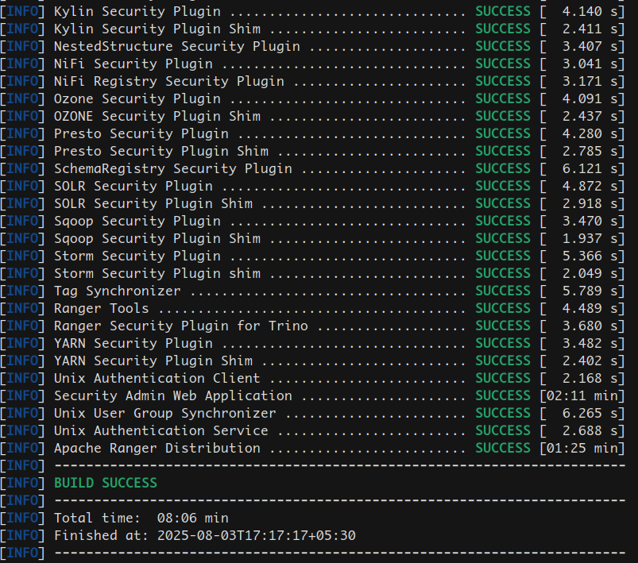
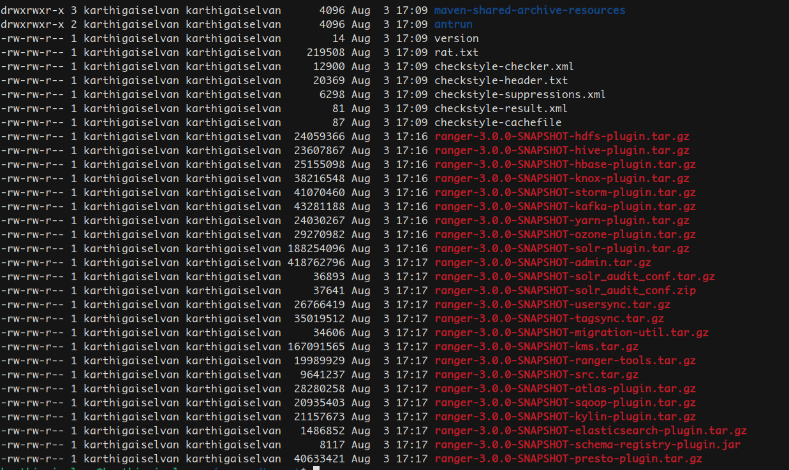

## Building Apache Ranger from source

As of this document (Aug 03, 2025), Apache Ranger still doesn't provide tar ball file to deploy so we need to build it ourselves. This guide will help do exactly the same,

Prerequisites:

* Java 8
* Maven

### 1. Check out the code from GIT repository

```bash
git clone https://gitbox.apache.org/repos/asf/ranger.git
cd ranger
```

Alternatively, you can checkout the code from github:

```bash
git clone https://github.com/apache/ranger
cd ranger
```

### 2. Ensure you have set JAVA_HOME and execute the following maven commands

```bash
export JAVA_HOME=%jdk 7 Home%
mvn -Pall clean 
mvn -Pall -DskipTests=false clean compile package install # if you want to skip tests, set -DskipTests=true
```

If the build is successful, you will see the below BUILD SUCCESS message



### 3. Apache Ranger Admin tar ball and other plugins

Once the build is success, all the required tar balls can be found under *target/* directory



There are two server side components:
### 1. 🛡️ Apache Ranger Admin
Purpose: UI-based central security policy administration

✅ What it does:⚙️ Optional but Recommended
Ranger Admin is mandatory to manage policies.

Ranger UserSync is optional but recommended for production deployments using LDAP or Active Directory.
Policy Management: Provides a web UI and REST APIs for administrators to define fine-grained access control policies for various data sources (like Hive, Trino, HDFS, Kafka, etc.).

Audit Logs: Stores and displays audit trails (who accessed what, when, and whether it was allowed or denied).

Plugins Communication: Pushes policies to Ranger plugins running within data source services (like Trino or Hive).

Database Backing: Stores all policies and metadata in a backend database (like MySQL/PostgreSQL).

🔗 Example:
You log into the Ranger Admin UI at http://<ranger-host>:608⚙️ Optional but Recommended
Ranger Admin is mandatory to manage policies.

Ranger UserSync is optional but recommended for production deployments using LDAP or Active Directory.0 and define:

A policy allowing user alice to run SELECT queries on the sales schema in Trino.

### 2. 👥 Apache Ranger UserSync
Purpose: Keeps Ranger Admin in sync with your organization’s identity system

✅ What it does:
Fetches users and groups from external identity providers like:

LDAP/Active Directory

Unix local user system

Syncs identities into the Ranger Admin database so you can build access control policies based on real users and groups.

Runs as a background daemon process.

🔗 Why it matters:
Without UserSync, you would have to manually create users and groups in Ranger Admin — not scalable or secure.

🔄 How They Work Together

```text
+---------------------+        REST/API        +-----------------------+
| External LDAP/AD    |----------------------->| Ranger UserSync       |
|                     |                        | (syncs users/groups)  |
+---------------------+                        +-----------------------+
                                                       |
                                                       v
                                                +--------------+
                                                | Ranger Admin |
                                                |  UI + DB     |
                                                +--------------+
                                                       |
                                       pushes policies  |
                                                       v
                                            +------------------+
                                            | Ranger Plugin     |
                                            | (Trino, Hive etc) |
                                            +------------------+

```

⚙️ Optional but Recommended
* Ranger Admin is mandatory to manage policies.
* Ranger UserSync is optional but recommended for production deployments using LDAP or Active Directory.